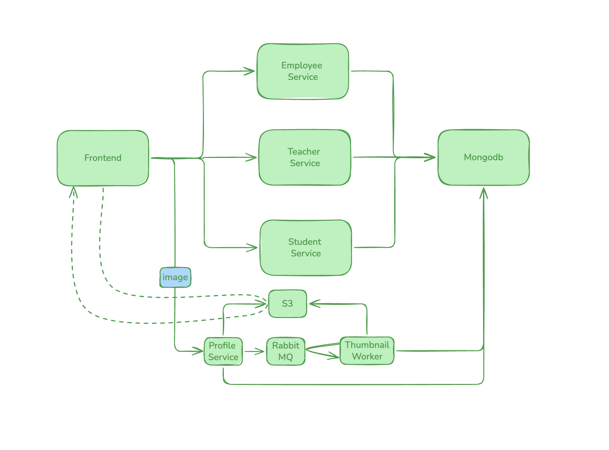

# Kindergarten Project — Run Locally

Run the frontend and APIs on your computer. Docker Compose runs MongoDB,
RabbitMQ, RustFS, and the MongoDB dashboard.



## Step 1: Prepare the project

Install Docker Compose, Node.js 22+, Go 1.23+, Python 3.13+, JDK 17, and Maven.
Open a terminal in the repository root.

Copy the example environment files:

- in every directory there is a .env.example, make it .env for the application to read it

- Set credentials in the root `.env`. Update each service's `.env` with matching
MongoDB, RabbitMQ, and RustFS credentials where required. Keep these files
private; do not commit credentials.

## Step 2: Start the supporting services

From the repository root, run:

```sh
docker compose up -d
docker compose ps
```

Open the MongoDB dashboard at [http://localhost:8081](http://localhost:8081).
Sign in with `MONGO_ROOT_USERNAME` and `MONGO_ROOT_PASSWORD` from `.env`.

Other consoles:

| Service | Address |
| --- | --- |
| RustFS | http://localhost:9001/rustfs/console/ |
| RabbitMQ | http://localhost:15672 |

Use the corresponding credentials in the root `.env`.

Every service below runs in its own terminal. Keep each one running.
Each service reads its own `.env` file from its folder, so always start it
from inside that folder.

## Step 3: Student service (Go, port 5001)

```sh
cd studentservice
go mod tidy
go run main.go
```

Check: http://localhost:5001/students returns a list (empty is fine).
## Step 4: Frontend (React, port 3000)

```sh
cd frontend
npm i
npm start
```

Open [http://localhost:3000](http://localhost:3000). API addresses default to
ports `5001`–`5004`; change them in `frontend/.env` and restart if needed.

## Step 5: Teacher service (Java, port 5002)

Requires **JDK 17** (newer versions break the build) and Maven.

In the teacher service terminal, point to JDK 17 and confirm it
(repeat in every new terminal):

```sh
mvn -version    # must show: Java version: 17
```

Build and run:

```sh
cd teacherservice
mvn clean package
java -jar target/teacherservice-1.0.0.jar
```

The first start downloads dependencies and can take a few minutes.
Check: http://localhost:5002/teachers returns a list.

## Step 6: Employee service (Python, port 5003)

```sh
cd employeeservice
pip install -r requirements.txt
python app.py
```

Check: http://localhost:5003/employees returns a list.

## Step 7: Profile (media) service (Node.js, port 5004)

Uploads photos to RustFS and queues thumbnail jobs in RabbitMQ.

```sh
cd profileservice
npm i
npm start
```

Check: http://localhost:5004/ready reports ready.

## Step 8: Thumbnail worker (Python)

Start it after the profile service. It turns uploaded photos into thumbnails.

```sh
cd thumbnailworker

pip install -r requirements.txt
python worker.py
```

Check: the terminal shows it is waiting for messages.


## Step 9: Verify everything

- The footer shows **3 of 3 services connected**.
- The Students, Teachers, and Employees tabs load and accept new records.
- A record with a photo shows **Processing**, then a thumbnail.
- The MongoDB dashboard shows the new records in the `kindergarten` database.
